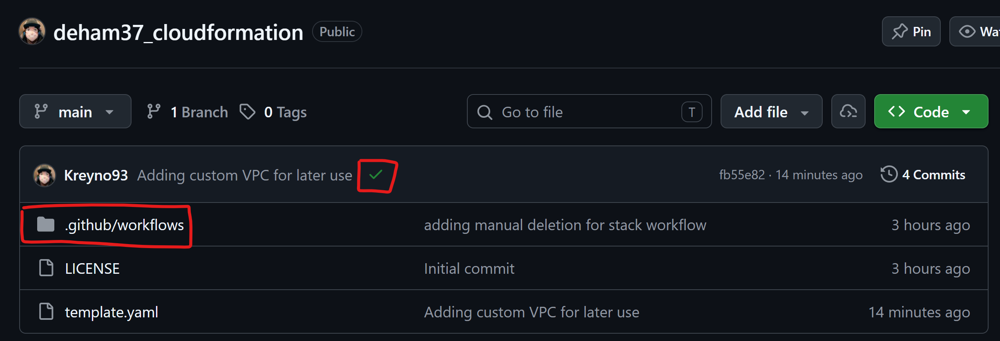
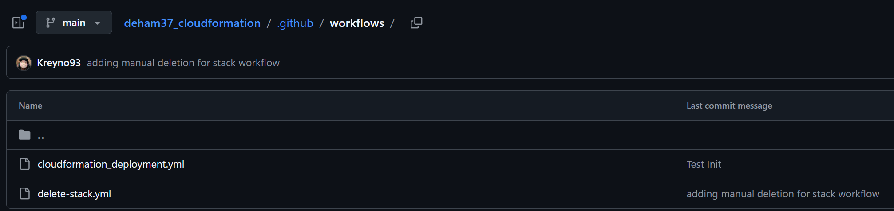
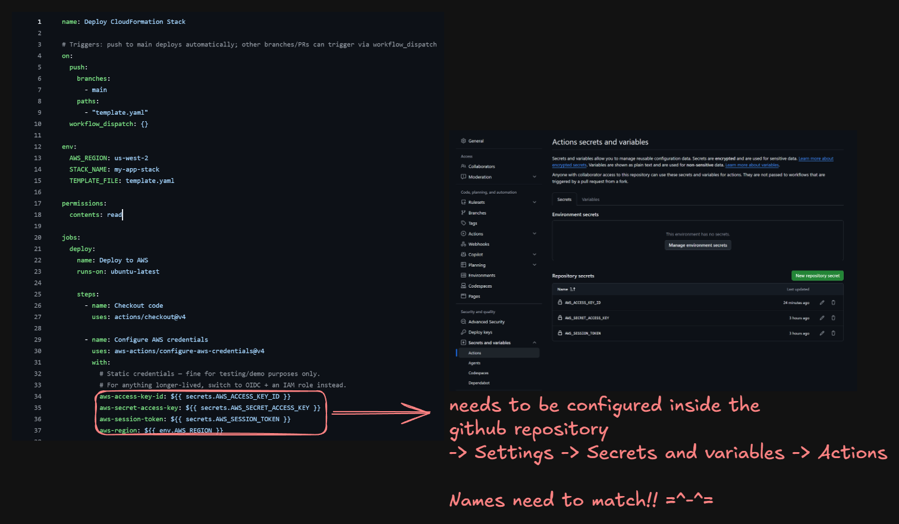

# CloudFormation + GitHub Actions — Practice Repo

This repo shows a minimal but complete workflow for deploying AWS infrastructure with **CloudFormation**, automatically, via **GitHub Actions**. Push a change to `template.yaml` and GitHub does the deployment for you — no local AWS CLI setup required.

It's built as a learning template: fork/copy it, swap in your own CloudFormation resources, and reuse the two workflow files as-is.

## What's in this repo

```text
.
├── template.yaml                  # The CloudFormation stack definition
└── .github/
    └── workflows/
        ├── cloudformation_deployment.yml  # Deploys the stack automatically
        └── delete-stack.yml               # Manually tears the stack down
```

`template.yaml` currently defines:

- an **EC2 instance** (`t3.micro`, latest Amazon Linux 2023, using the `vockey` key pair provided in AWS re/Start Sandboxes)
- a **Security Group** allowing inbound SSH (port 22)
- a **VPC** (`myVPC`) as a demonstration of a custom network resource
- **Outputs** for the instance ID and its public IP, so you can see them after deployment

You will replace/extend these resources with whatever infrastructure your own project needs — the workflow files don't need to change for that.

## How the pieces fit together

1. You write/edit AWS resources in **`template.yaml`**.
2. You push that change to the **`main`** branch.
3. GitHub Actions picks it up via the workflow in **`.github/workflows/cloudformation_deployment.yml`**, logs into AWS using credentials stored as **GitHub Secrets**, validates the template, and deploys it with `aws cloudformation deploy`.
4. If you need to tear the stack down again, you trigger **`delete-stack.yml`** manually from the "Actions" tab.

No one needs the AWS CLI installed locally — everything happens in GitHub's runners.

---

## Setting up your own repo like this

### 1. Create the `.github/workflows` directory

GitHub only recognizes workflow files if they live in exactly this path, at the root of the repo:

```text
.github/workflows/
```

Both `.yml` files must go inside that folder. Once they exist on the default branch, they show up under your repo's **Actions** tab.



The green checkmark ✅ next to a commit (see above) means the workflow triggered by that commit ran successfully. A red ✗ means it failed — click into the **Actions** tab and open the run to see the logs and find out why.

### 2. Add the two workflow files

Copy `cloudformation_deployment.yml` and `delete-stack.yml` from this repo's `.github/workflows/` folder into yours.



**`cloudformation_deployment.yml`** — runs automatically:

- Triggers on every push to `main` **that changes `template.yaml`**, or manually via "Run workflow" (`workflow_dispatch`).
- Checks out the code, configures AWS credentials, validates the template, then deploys it with `aws cloudformation deploy`.
- Prints the stack outputs (like the EC2 public IP) at the end so you don't have to go digging in the AWS Console.

**`delete-stack.yml`** — runs only when you trigger it:

- This is `workflow_dispatch`-only on purpose. **Deleting infrastructure should never happen automatically on a push.**
- To run it: go to **Actions → Delete CloudFormation Stack → Run workflow**, and type `delete` into the confirmation field exactly. The job only runs `if` that input equals `"delete"` — anything else (typos included) and the job is skipped.

### 3. Add your AWS credentials as GitHub Secrets — names must match exactly

The workflows read your AWS credentials from `secrets.AWS_ACCESS_KEY_ID`, `secrets.AWS_SECRET_ACCESS_KEY`, and `secrets.AWS_SESSION_TOKEN`. GitHub only exposes a secret to a workflow if the secret's **name matches exactly** — same casing, same underscores, no typos.

Go to your repo's **Settings → Secrets and variables → Actions → New repository secret** and create these three:

| Secret name             | Value                   |
| ----------------------- | ----------------------- |
| `AWS_ACCESS_KEY_ID`     | your AWS access key     |
| `AWS_SECRET_ACCESS_KEY` | your AWS secret key     |
| `AWS_SESSION_TOKEN`     | your AWS session token  |



> **Names need to match!!** If you name one `AWS_ACCESS_KEY` instead of `AWS_ACCESS_KEY_ID`, the workflow step "Configure AWS credentials" will fail (or silently pass an empty value) because `${{ secrets.AWS_ACCESS_KEY_ID }}` won't find anything.

**Where do these three values come from?**

- **AWS re/Start Sandbox:** open your sandbox, click **AWS Details**, then **Show** next to *AWS CLI: Credentials*. Copy the three values (`aws_access_key_id`, `aws_secret_access_key`, `aws_session_token`) into the matching GitHub secrets.
- **A "real" AWS account:** create an IAM user with programmatic access (or, better, use short-lived credentials from `aws sts get-session-token` / SSO). In that case you may not have a session token at all — you can leave `AWS_SESSION_TOKEN` secret unset/empty, since `aws-actions/configure-aws-credentials` treats an empty value as "no token".

**Important — Sandbox credentials expire.** AWS re/Start Sandbox sessions time out (usually after a few hours), and your session token becomes invalid. If your deployment suddenly starts failing with an authentication/expired-token error, go back into your sandbox, grab fresh credentials, and **update the three secrets** (edit, don't just add new ones — the names must stay the same).

### 4. Adjust the workflow's environment variables to your project

Near the top of `cloudformation_deployment.yml` (and mirrored in `delete-stack.yml`) you'll find:

```yaml
env:
  AWS_REGION: us-west-2
  STACK_NAME: my-app-stack
  TEMPLATE_FILE: template.yaml
```

- `AWS_REGION` — must match the region your AWS re/Start Sandbox (or account) actually runs in. `template.yaml` references `us-west-2` resources (the AMI SSM parameter), so if you change the region, double-check the template still makes sense there.
- `STACK_NAME` — whatever you want to call your CloudFormation stack. Keep it consistent between the deploy and delete workflows so `delete-stack.yml` tears down the same stack the deploy workflow created.
- `TEMPLATE_FILE` — only change this if you rename `template.yaml`.

### 5. Push and watch it deploy

Commit a change to `template.yaml` on `main` (even a small one, like adding a tag) and push. Go to the **Actions** tab — you should see "Deploy CloudFormation Stack" running. Once it finishes with a green checkmark, check the **CloudFormation console** in AWS to see your stack, or scroll to the bottom of the workflow run's log for the "Show stack outputs" step (public IP, instance ID, etc.).

### 6. Tearing it down

When you're done experimenting (or your Learner Lab session is ending), go to **Actions → Delete CloudFormation Stack → Run workflow**, type `delete` in the confirmation box, and run it. This avoids leaving billable resources running by accident.

---

## Common gotchas

- **Workflow doesn't trigger at all** → check that your push actually touched `template.yaml` and landed on `main`. The deploy workflow's `paths:` filter ignores changes to any other file.
- **"Unable to locate credentials" / auth errors** → a secret name doesn't match, is empty, or your Learner Lab session token expired. Re-check secret names against the table above, and refresh Learner Lab credentials if needed.
- **`CAPABILITY_NAMED_IAM` error** → this is already passed in the deploy step. You'll only hit related errors if you add IAM resources to `template.yaml` that need capabilities not yet covered (add `CAPABILITY_AUTO_EXPAND` if you introduce nested stacks/macros).
- **Stack stuck in `ROLLBACK_COMPLETE`** → CloudFormation won't let you update a stack in this state. Delete it first (via `delete-stack.yml` or the console), then re-run the deploy workflow.
- **Region mismatch** → resources like the `LatestAmiId` SSM parameter and the default VPC are region-specific. If you change `AWS_REGION`, make sure every resource in `template.yaml` is valid in that region.

## Security note

The workflows use **static IAM credentials** stored as GitHub Secrets. This is fine for learning/demo purposes (and is basically required in AWS re/Start Sandboxes, which only issue temporary static credentials). For any real, longer-lived project, prefer **OIDC federation** with an IAM role instead of long-lived access keys — see [`aws-actions/configure-aws-credentials`](https://github.com/aws-actions/configure-aws-credentials) for how to set that up.

---

*Footnote (EU AI Act transparency): this README was drafted with the assistance of an AI system (Claude, by Anthropic), based on the repository's existing files and screenshots. It was reviewed by a human before publishing. See the [EU AI Act — High-Level Summary](https://artificialintelligenceact.eu/high-level-summary/) for background on AI transparency obligations.*
